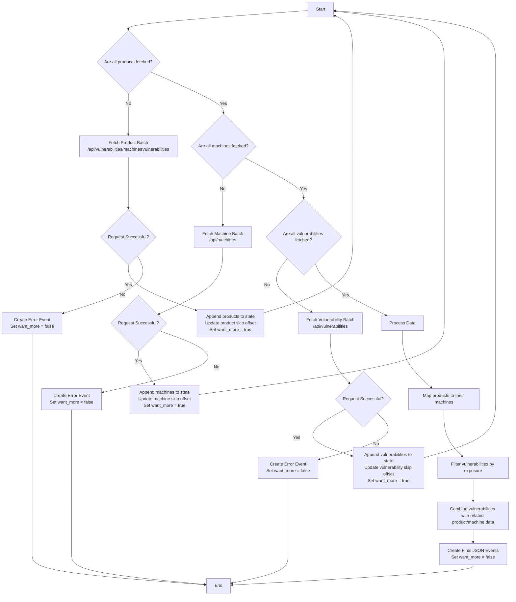

### `m365_defender.vulerabilities` CEL Program Overview

This Common Expression Language (CEL) program is designed to run in an iterative, stateful manner. Its primary goal is to fetch data from three distinct endpoints of the Microsoft 365 Defender API, combine the data, and then format it into a series of JSON events.

The program operates in four main phases:
1.  **Fetch Products:** It retrieves all product vulnerabilities.
2.  **Fetch Machines:** It retrieves all machine information.
3.  **Fetch Vulnerabilities:** It retrieves all vulnerability definitions.
4.  **Process and Combine:** It maps the relationships between vulnerabilities, the machines they affect, and the products involved, then generates the final event data.

The program uses a state mechanism (`state.*`) to keep track of its progress. It fetches data in batches and continues from where it left off in the next execution until it has retrieved all necessary data. The `want_more` flag in the state tells the execution environment whether to run the program again immediately.

### Execution Flow

The program's logic can be visualized as a sequence of data collection stages followed by a final processing stage.

### Detailed Breakdown

1.  **Phase 1: Fetch Products**
    *   The program first checks if it has already fetched all products (`state.is_all_products_fetched`).
    *   If not, it sends a `GET` request to the `/api/vulnerabilities/machinesVulnerabilities` endpoint using a batch size and offset (`$top`, `$skip`) managed in the state.
    *   On a successful response (HTTP 200), it appends the fetched products to the list in its state, increments the `product_skip` offset for the next batch, and sets `want_more` to `true` to signal another iteration. This loop continues until an empty batch is returned, at which point `is_all_products_fetched` is set to `true`.
    *   If the request fails, it generates an error event and stops.

2.  **Phase 2: Fetch Machines**
    *   Once all products are fetched, the program moves to fetching machines. It checks the `is_all_machines_fetched` flag.
    *   It follows the same batching logic as in Phase 1, but this time it calls the `/api/machines` endpoint.
    *   It continues fetching and appending machine data until the API returns an empty batch, then sets `is_all_machines_fetched` to `true`.

3.  **Phase 3: Fetch Vulnerabilities**
    *   With products and machines collected, the program proceeds to fetch vulnerability definitions from the `/api/vulnerabilities` endpoint.
    *   This phase follows the same iterative, batch-based pattern as the previous two, managed by the `is_all_vulnerabilities_fetched` flag and its own `skip` and `batch_size` state variables.

4.  **Phase 4: Process and Combine Data**
    *   After all data has been successfully retrieved, the program enters its final phase in a single execution.
    *   **Map Products to Machines:** It joins the list of products with the list of machines using `machineId` to create a comprehensive product record that includes machine details.
    *   **Filter and Combine:** It filters the list of vulnerabilities to separate those with exposed machines from those without. It then maps the affected machines to their corresponding vulnerabilities.
    *   **Generate Events:** Finally, it constructs the JSON output. For each vulnerability and its associated machine, it creates a JSON event. It also creates events for vulnerabilities that have no exposed machines.
    *   **Signal Completion:** It sets `want_more` to `false`, indicating that the process is complete and the program should not be run again.